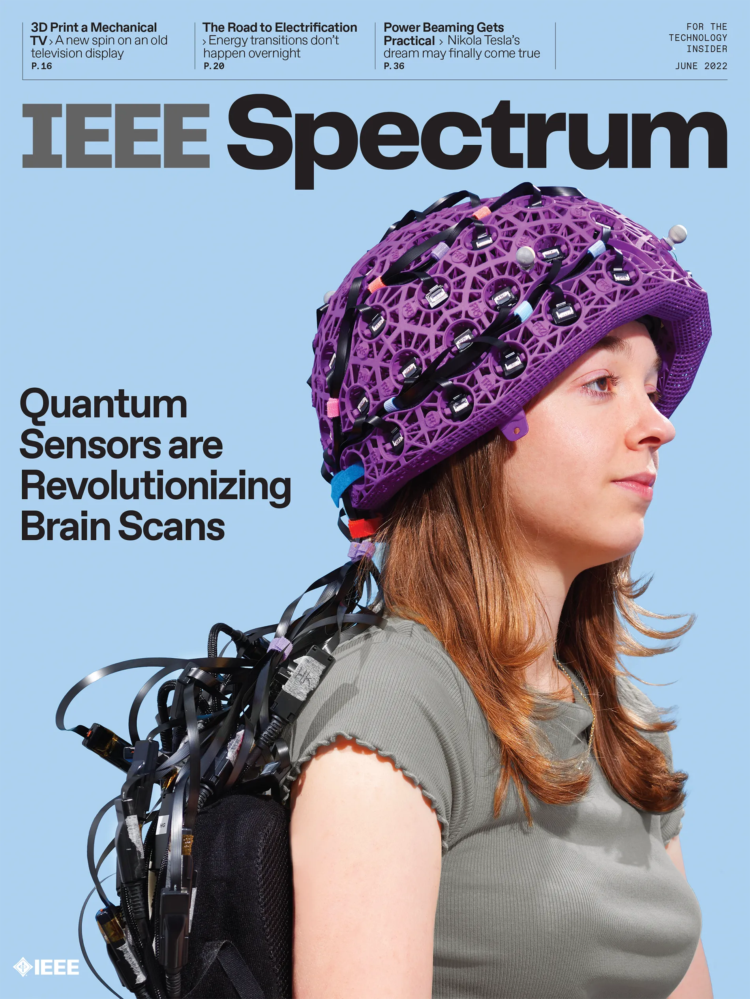

# viral.affective2022

<!-- 🦋: Affective Computing and Ethics Fall 2022 -->

  

## 🔥 Resources for UI/UX, ML, and more

🧠 + 📺 [User Experience Design](https://en.wikipedia.org/wiki/User_experience_design)
* [Cognitive Psychology](https://en.wikipedia.org/wiki/Cognitive_psychology)
* [Human factors design](https://en.wikipedia.org/wiki/Human_factors_and_ergonomics)
* [Human-computer interaction](https://en.wikipedia.org/wiki/Human%E2%80%93computer_interaction)
* [Algorithmic Information Theory](https://www.youtube.com/results?search_query=algorithmic+information+theory)
  * Paper: [*Working towards understanding aesthetic judgments*](https://static.googleusercontent.com/media/research.google.com/en//pubs/archive/38315.pdf)

📺 [User Interface Design](https://en.wikipedia.org/wiki/User_interface)

* [Design language systems](https://uxplanet.org/design-language-system-d438f4aa30e0)
  * [Material Design](https://material.io/design/)
  * [Carbon](https://www.carbondesignsystem.com/)
  * [🍎](https://developer.apple.com/design/human-interface-guidelines/)
  * [Skeuomorphism](https://en.wikipedia.org/wiki/Skeuomorph)
  * [Neumorphism](https://medium.com/@artofofiare/neumorphism-the-right-way-a-2020-design-trend-386e6a09040a)
  * [People + AI Guidebook](https://pair.withgoogle.com/guidebook/)
* UI Tools 🛠
  * [Neumorphism.io](https://neumorphism.io/#e0e0e0)
  * [uiverse.io](https://uiverse.io/)
  

🧠 [Machine Learning](https://en.wikipedia.org/wiki/Outline_of_machine_learning)

* Machine learning tools  🛠
    * Open source machine learning frameworks = {Caffe, [PyTorch](https://pytorch.org/), [TensorFlow](https://www.tensorflow.org/), Torch, CNTK, [➰](https://slm-lab.gitbook.io/slm-lab/)}
  * [OpenAI](https://openai.com/about/)
      * [OpenAI API](https://beta.openai.com/docs/)
      * [OpenAI Playground](https://beta.openai.com/playground)
  * [HuggingFace](https://huggingface.co/)
      * [AutoTrain](https://huggingface.co/autotrain)
  * [AI Hub](https://aihub.cloud.google.com/)
  * [labml.ai](https://labml.ai/)
  *  Machine Learning Environments 💿 🎮 👾
     * [OpenAI gym](https://www.gymlibrary.dev/)
     * OpenAI Roboschool
     * VizDoom
     * [MuJoCo](https://www.gymlibrary.dev/environments/mujoco/)

* Machine learning theory 📚
  * [Computational learning theory](https://en.wikipedia.org/wiki/Computational_learning_theory)
  * [Grammar inference](https://en.wikipedia.org/wiki/Grammar_induction)

  * Machine learning methods 🎣
    * Reinforcement learning
    * Supervised learning
    * [Meta learning]()
    * Deep learning
    * Beyesian

  * Quantum machine learning 🧠 🧠
    
    * Paper: [*Bloch Sphere-Based Representation for Quantum Emotion Space*]()
    * Paper: [*Conceptual Framework for Quantum Affective Computing and Its Use in Fusion of Multi-Robot Emotions*](https://en.x-mol.com/paper/article/1346931694848069632)

  * Machine learning books 📖
    * General
      * [_Hands-On Machine Learning with Scikit-Learn and TensorFlow_](https://www.amazon.com/Hands-Machine-Learning-Scikit-Learn-TensorFlow/dp/1491962291)  
      * [_Foundations of Deep Reinforcement Learning: Theory and Practice in Python_](https://www.amazon.com/Deep-Reinforcement-Learning-Python-Hands/dp/0135172381)
  
    * Generative Adversarial Neural Networks
      * [_Making Pictures With Generative Adversarial Networks - Casey Reas_](https://www.anteism.com/shop/making-pictures-with-generative-adversarial-networks-casey-reas)

👾 [Game Design](https://en.wikipedia.org/wiki/Game_design)

* [Game studies](https://en.wikipedia.org/wiki/Game_studies) 📚
  * [Role-playing](https://en.wikipedia.org/wiki/Role-playing_game)
  * [Game theory](https://en.wikipedia.org/wiki/Game_theory)
  * [Gaming platforms (paradigms)](https://www.dailysabah.com/life/strategy-showdown-in-gaming-nintendo-vs-sony-vs-microsoft/news)
* Game design tools 🛠
  * [Unity](https://en.wikipedia.org/wiki/Unity_(game_engine))
